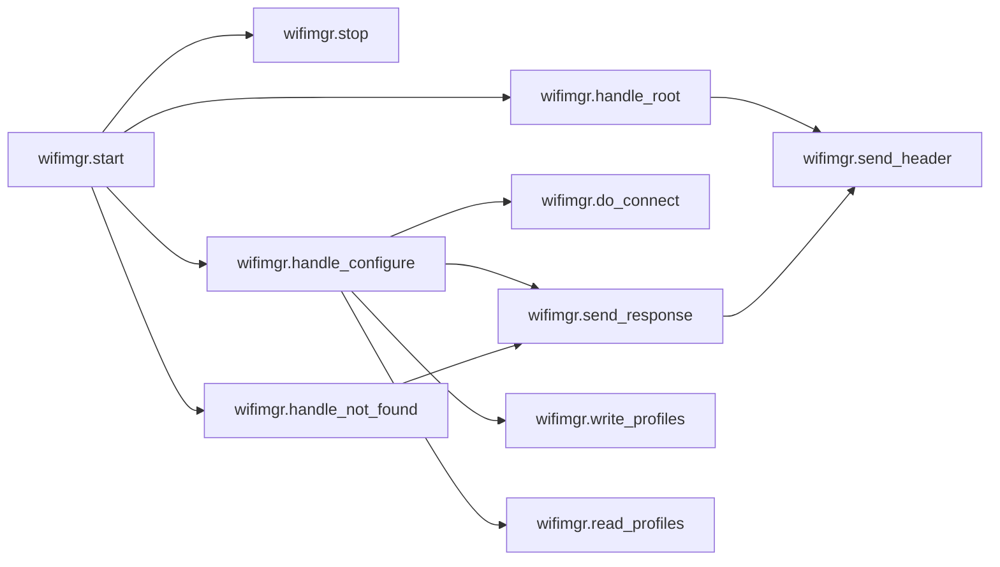
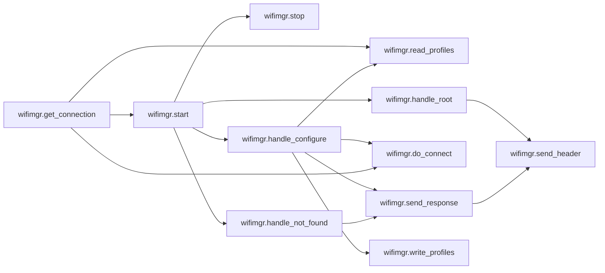
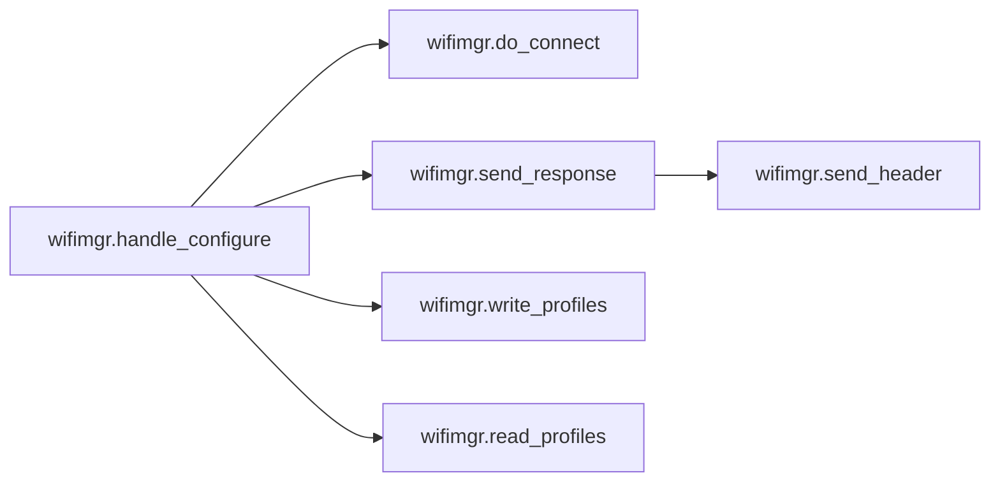

# Key Objects

[_Documentation generated by Documatic_](https://www.documatic.com)

<!---Documatic-section-wifimgr.write_profiles-start--->
## wifimgr.write_profiles

<!---Documatic-section-write_profiles-start--->
<!---Documatic-block-wifimgr.write_profiles-start--->
<details>
	<summary><code>wifimgr.write_profiles</code> code snippet</summary>

```python
def write_profiles(profiles):
    lines = []
    for (ssid, password) in profiles.items():
        lines.append('%s;%s\n' % (ssid, password))
    with open(NETWORK_PROFILES, 'w') as f:
        f.write(''.join(lines))
```
</details>
<!---Documatic-block-wifimgr.write_profiles-end--->
<!---Documatic-section-write_profiles-end--->

# #
<!---Documatic-section-wifimgr.write_profiles-end--->

<!---Documatic-section-wifimgr.do_connect-start--->
## wifimgr.do_connect

<!---Documatic-section-do_connect-start--->
<!---Documatic-block-wifimgr.do_connect-start--->
<details>
	<summary><code>wifimgr.do_connect</code> code snippet</summary>

```python
def do_connect(ssid, password):
    wlan_sta.active(True)
    if wlan_sta.isconnected():
        return None
    print('Trying to connect to %s...' % ssid)
    wlan_sta.connect(ssid, password)
    for retry in range(100):
        connected = wlan_sta.isconnected()
        if connected:
            break
        time.sleep(0.1)
        print('.', end='')
    if connected:
        print('\nConnected. Network config: ', wlan_sta.ifconfig())
    else:
        print('\nFailed. Not Connected to: ' + ssid)
    return connected
```
</details>
<!---Documatic-block-wifimgr.do_connect-end--->
<!---Documatic-section-do_connect-end--->

# #
<!---Documatic-section-wifimgr.do_connect-end--->

<!---Documatic-section-wifimgr.start-start--->
## wifimgr.start

<!---Documatic-section-start-start--->


### Object Calls

* wifimgr.stop
* wifimgr.handle_root
* wifimgr.handle_configure
* wifimgr.handle_not_found

<!---Documatic-block-wifimgr.start-start--->
<details>
	<summary><code>wifimgr.start</code> code snippet</summary>

```python
def start(port=80):
    global server_socket
    addr = socket.getaddrinfo('0.0.0.0', port)[0][-1]
    stop()
    wlan_sta.active(True)
    wlan_ap.active(True)
    wlan_ap.config(essid=ap_ssid, password=ap_password, authmode=ap_authmode)
    server_socket = socket.socket()
    server_socket.bind(addr)
    server_socket.listen(1)
    print('Connect to WiFi ssid ' + ap_ssid + ', default password: ' + ap_password)
    print('and access the ESP via your favorite web browser at 192.168.4.1.')
    print('Listening on:', addr)
    while True:
        if wlan_sta.isconnected():
            return True
        (client, addr) = server_socket.accept()
        print('client connected from', addr)
        try:
            client.settimeout(5.0)
            request = b''
            try:
                while '\r\n\r\n' not in request:
                    request += client.recv(512)
            except OSError:
                pass
            print('Request is: {}'.format(request))
            if 'HTTP' not in request:
                continue
            try:
                url = ure.search('(?:GET|POST) /(.*?)(?:\\?.*?)? HTTP', request).group(1).decode('utf-8').rstrip('/')
            except Exception:
                url = ure.search('(?:GET|POST) /(.*?)(?:\\?.*?)? HTTP', request).group(1).rstrip('/')
            print('URL is {}'.format(url))
            if url == '':
                handle_root(client)
            elif url == 'configure':
                handle_configure(client, request)
            else:
                handle_not_found(client, url)
        finally:
            client.close()
```
</details>
<!---Documatic-block-wifimgr.start-end--->
<!---Documatic-section-start-end--->

# #
<!---Documatic-section-wifimgr.start-end--->

<!---Documatic-section-wifimgr.read_profiles-start--->
## wifimgr.read_profiles

<!---Documatic-section-read_profiles-start--->
<!---Documatic-block-wifimgr.read_profiles-start--->
<details>
	<summary><code>wifimgr.read_profiles</code> code snippet</summary>

```python
def read_profiles():
    with open(NETWORK_PROFILES) as f:
        lines = f.readlines()
    profiles = {}
    for line in lines:
        (ssid, password) = line.strip('\n').split(';')
        profiles[ssid] = password
    return profiles
```
</details>
<!---Documatic-block-wifimgr.read_profiles-end--->
<!---Documatic-section-read_profiles-end--->

# #
<!---Documatic-section-wifimgr.read_profiles-end--->

<!---Documatic-section-wifimgr.handle_not_found-start--->
## wifimgr.handle_not_found

<!---Documatic-section-handle_not_found-start--->


### Object Calls

* wifimgr.send_response

<!---Documatic-block-wifimgr.handle_not_found-start--->
<details>
	<summary><code>wifimgr.handle_not_found</code> code snippet</summary>

```python
def handle_not_found(client, url):
    send_response(client, 'Path not found: {}'.format(url), status_code=404)
```
</details>
<!---Documatic-block-wifimgr.handle_not_found-end--->
<!---Documatic-section-handle_not_found-end--->

# #
<!---Documatic-section-wifimgr.handle_not_found-end--->

<!---Documatic-section-wifimgr.handle_root-start--->
## wifimgr.handle_root

<!---Documatic-section-handle_root-start--->


### Object Calls

* wifimgr.send_header

<!---Documatic-block-wifimgr.handle_root-start--->
<details>
	<summary><code>wifimgr.handle_root</code> code snippet</summary>

```python
def handle_root(client):
    wlan_sta.active(True)
    ssids = sorted((ssid.decode('utf-8') for (ssid, *_) in wlan_sta.scan()))
    send_header(client)
    client.sendall('        <html>\n            <h1 style="color: #5e9ca0; text-align: center;">\n                <span style="color: #ff0000;">\n                    Wi-Fi Client Setup\n                </span>\n            </h1>\n            <form action="configure" method="post">\n                <table style="margin-left: auto; margin-right: auto;">\n                    <tbody>\n    ')
    while len(ssids):
        ssid = ssids.pop(0)
        client.sendall('                        <tr>\n                            <td colspan="2">\n                                <input type="radio" name="ssid" value="{0}" />{0}\n                            </td>\n                        </tr>\n        '.format(ssid))
    client.sendall('                        <tr>\n                            <td>Password:</td>\n                            <td><input name="password" type="password" /></td>\n                        </tr>\n                    </tbody>\n                </table>\n                <p style="text-align: center;">\n                    <input type="submit" value="Submit" />\n                </p>\n            </form>\n            <p>&nbsp;</p>\n            <hr />\n            <h5>\n                <span style="color: #ff0000;">\n                    Your ssid and password information will be saved into the\n                    "%(filename)s" file in your ESP module for future usage.\n                    Be careful about security!\n                </span>\n            </h5>\n            <hr />\n            <h2 style="color: #2e6c80;">\n                Some useful infos:\n            </h2>\n            <ul>\n                <li>\n                    Original code from <a href="https://github.com/cpopp/MicroPythonSamples"\n                        target="_blank" rel="noopener">cpopp/MicroPythonSamples</a>.\n                </li>\n                <li>\n                    This code available at <a href="https://github.com/tayfunulu/WiFiManager"\n                        target="_blank" rel="noopener">tayfunulu/WiFiManager</a>.\n                </li>\n            </ul>\n        </html>\n    ' % dict(filename=NETWORK_PROFILES))
    client.close()
```
</details>
<!---Documatic-block-wifimgr.handle_root-end--->
<!---Documatic-section-handle_root-end--->

# #
<!---Documatic-section-wifimgr.handle_root-end--->

<!---Documatic-section-wifimgr.stop-start--->
## wifimgr.stop

<!---Documatic-section-stop-start--->
<!---Documatic-block-wifimgr.stop-start--->
<details>
	<summary><code>wifimgr.stop</code> code snippet</summary>

```python
def stop():
    global server_socket
    if server_socket:
        server_socket.close()
        server_socket = None
```
</details>
<!---Documatic-block-wifimgr.stop-end--->
<!---Documatic-section-stop-end--->

# #
<!---Documatic-section-wifimgr.stop-end--->

<!---Documatic-section-wifimgr.send_response-start--->
## wifimgr.send_response

<!---Documatic-section-send_response-start--->


### Object Calls

* wifimgr.send_header

<!---Documatic-block-wifimgr.send_response-start--->
<details>
	<summary><code>wifimgr.send_response</code> code snippet</summary>

```python
def send_response(client, payload, status_code=200):
    content_length = len(payload)
    send_header(client, status_code, content_length)
    if content_length > 0:
        client.sendall(payload)
    client.close()
```
</details>
<!---Documatic-block-wifimgr.send_response-end--->
<!---Documatic-section-send_response-end--->

# #
<!---Documatic-section-wifimgr.send_response-end--->

<!---Documatic-section-wifimgr.get_connection-start--->
## wifimgr.get_connection

<!---Documatic-section-get_connection-start--->


### Object Calls

* wifimgr.read_profiles
* wifimgr.start
* wifimgr.do_connect

<!---Documatic-block-wifimgr.get_connection-start--->
<details>
	<summary><code>wifimgr.get_connection</code> code snippet</summary>

```python
def get_connection():
    if wlan_sta.isconnected():
        return wlan_sta
    connected = False
    try:
        time.sleep(3)
        if wlan_sta.isconnected():
            return wlan_sta
        profiles = read_profiles()
        wlan_sta.active(True)
        networks = wlan_sta.scan()
        AUTHMODE = {0: 'open', 1: 'WEP', 2: 'WPA-PSK', 3: 'WPA2-PSK', 4: 'WPA/WPA2-PSK'}
        for (ssid, bssid, channel, rssi, authmode, hidden) in sorted(networks, key=lambda x: x[3], reverse=True):
            ssid = ssid.decode('utf-8')
            encrypted = authmode > 0
            print('ssid: %s chan: %d rssi: %d authmode: %s' % (ssid, channel, rssi, AUTHMODE.get(authmode, '?')))
            if encrypted:
                if ssid in profiles:
                    password = profiles[ssid]
                    connected = do_connect(ssid, password)
                else:
                    print('skipping unknown encrypted network')
            else:
                connected = do_connect(ssid, None)
            if connected:
                break
    except OSError as e:
        print('exception', str(e))
    if not connected:
        connected = start()
    return wlan_sta if connected else None
```
</details>
<!---Documatic-block-wifimgr.get_connection-end--->
<!---Documatic-section-get_connection-end--->

# #
<!---Documatic-section-wifimgr.get_connection-end--->

<!---Documatic-section-wifimgr.handle_configure-start--->
## wifimgr.handle_configure

<!---Documatic-section-handle_configure-start--->


### Object Calls

* wifimgr.do_connect
* wifimgr.send_response
* wifimgr.write_profiles
* wifimgr.read_profiles

<!---Documatic-block-wifimgr.handle_configure-start--->
<details>
	<summary><code>wifimgr.handle_configure</code> code snippet</summary>

```python
def handle_configure(client, request):
    match = ure.search('ssid=([^&]*)&password=(.*)', request)
    if match is None:
        send_response(client, 'Parameters not found', status_code=400)
        return False
    try:
        ssid = match.group(1).decode('utf-8').replace('%3F', '?').replace('%21', '!')
        password = match.group(2).decode('utf-8').replace('%3F', '?').replace('%21', '!')
    except Exception:
        ssid = match.group(1).replace('%3F', '?').replace('%21', '!')
        password = match.group(2).replace('%3F', '?').replace('%21', '!')
    if len(ssid) == 0:
        send_response(client, 'SSID must be provided', status_code=400)
        return False
    if do_connect(ssid, password):
        response = '            <html>\n                <center>\n                    <br><br>\n                    <h1 style="color: #5e9ca0; text-align: center;">\n                        <span style="color: #ff0000;">\n                            ESP successfully connected to WiFi network %(ssid)s.\n                        </span>\n                    </h1>\n                    <br><br>\n                </center>\n            </html>\n        ' % dict(ssid=ssid)
        send_response(client, response)
        try:
            profiles = read_profiles()
        except OSError:
            profiles = {}
        profiles[ssid] = password
        write_profiles(profiles)
        time.sleep(5)
        return True
    else:
        response = '            <html>\n                <center>\n                    <h1 style="color: #5e9ca0; text-align: center;">\n                        <span style="color: #ff0000;">\n                            ESP could not connect to WiFi network %(ssid)s.\n                        </span>\n                    </h1>\n                    <br><br>\n                    <form>\n                        <input type="button" value="Go back!" onclick="history.back()"></input>\n                    </form>\n                </center>\n            </html>\n        ' % dict(ssid=ssid)
        send_response(client, response)
        return False
```
</details>
<!---Documatic-block-wifimgr.handle_configure-end--->
<!---Documatic-section-handle_configure-end--->

# #
<!---Documatic-section-wifimgr.handle_configure-end--->

<!---Documatic-section-wifimgr.send_header-start--->
## wifimgr.send_header

<!---Documatic-section-send_header-start--->
<!---Documatic-block-wifimgr.send_header-start--->
<details>
	<summary><code>wifimgr.send_header</code> code snippet</summary>

```python
def send_header(client, status_code=200, content_length=None):
    client.sendall('HTTP/1.0 {} OK\r\n'.format(status_code))
    client.sendall('Content-Type: text/html\r\n')
    if content_length is not None:
        client.sendall('Content-Length: {}\r\n'.format(content_length))
    client.sendall('\r\n')
```
</details>
<!---Documatic-block-wifimgr.send_header-end--->
<!---Documatic-section-send_header-end--->

# #
<!---Documatic-section-wifimgr.send_header-end--->

[_Documentation generated by Documatic_](https://www.documatic.com)